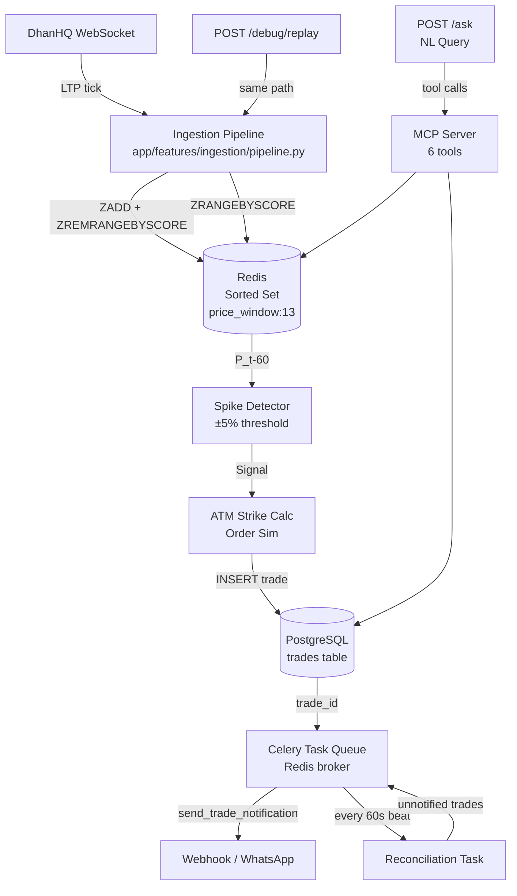

# TICKET-012: README & API Documentation

**Branch:** `feature/TICKET-012-readme-docs`  
**Priority:** P2 — Weighted equally with code; do last (captures real decisions)  
**Estimate:** ~2h

## Summary
Write the comprehensive README and API documentation. The spec states README is "weighted equally with code." It must answer 7 specific sections. Do this ticket AFTER all implementation is done so the documented decisions reflect actual choices made.

## Required README Sections

### 1. Architecture Decisions (one paragraph each with tradeoffs)
- **Redis structure:** Sorted Sets — why, what was rejected (Streams, Lists), the tradeoff accepted
- **Broker choice:** Redis vs RabbitMQ — why Redis won for this assignment, what durability was sacrificed
- **Index choice:** `created_at` index on trades — why, what queries it serves
- **ATM rounding:** 22425 edge case — round-half-up, why, financial convention

### 2. Celery Failure Semantics (Part 4c Q1–Q3)
- Already written in TICKET-008. Copy/refine here.
- Q1: Broker unreachable after Postgres commit
- Q2: Worker crashes after send but before ACK
- Q3: 200 spikes, 4-worker pool — tick ingestion and latency impact

### 3. Latency Numbers & Methodology
- What is measured (tick entry to signal decision)
- Where the code is (`app/features/ingestion/pipeline.py`, `app/metrics/latency.py`)
- How to reproduce: `POST /debug/replay` with sample file, read `latency_stats`
- Actual p50/p95/p99/max from a test run
- If missed: where the time goes

### 4. What You Cut & Why
- What was scoped out for time
- What would be built next and in what order

### 5. Questions Asked & What Was Done With Answers
- Ambiguities identified in the spec
- Decisions made (e.g., ATM rounding at 22425, cooldown period, premium mock)
- What would be escalated to the Stockwiz team before building

### 6. One Thing You Got Wrong
- Something believed at hour 2 that turned out wrong by hour 6
- Must be real — evaluators will know if this is fabricated

### 7. Architecture Design / Flow (Mermaid)

## API Documentation

Use FastAPI's built-in OpenAPI (`/docs`). Ensure all endpoints have:
- Summary and description
- Request/response schemas
- Example values

### Endpoints to Document
| Method | Path | Description |
|---|---|---|
| GET | /health | System health + consumer state |
| POST | /debug/replay | Replay NDJSON tick file |
| GET | /metrics/latency | Tick-to-signal latency stats |
| POST | /ask | Natural language trade query |
| GET | /trades | List recent trades (bonus) |

## Files to Create/Modify
- `README.md` — Full README (7 sections + architecture diagram)
- `.env.example` — Complete with all vars documented
- Inline FastAPI docstrings on all routes

## Acceptance Criteria
- [ ] README has all 7 required sections
- [ ] Mermaid architecture diagram renders correctly on GitHub
- [ ] Latency methodology is reproducible (someone can follow the steps)
- [ ] ATM 22425 decision is documented with reasoning
- [ ] Celery failure semantics Q1-Q3 are answered with reasoning (not just conclusions)
- [ ] `.env.example` has every env var used anywhere in the codebase

## Dependencies
- All other tickets (documents actual decisions made during implementation)

## Notes
- Write section 6 ("One thing you got wrong") last and honestly — it is a signal of engineering maturity
- The questions section (5) is where to surface the intentional ambiguities: cooldown period, premium source, ATM boundary behavior
